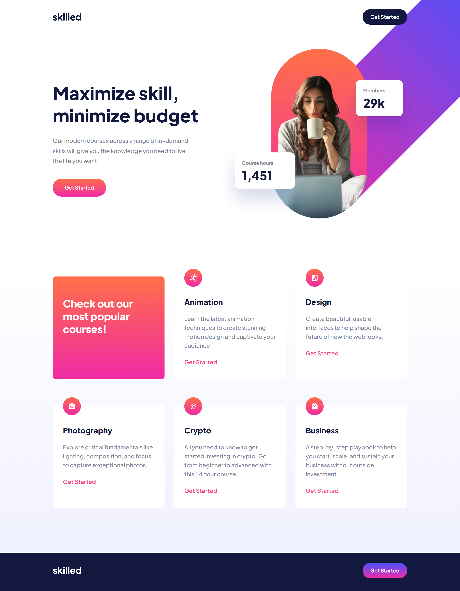

# Frontend Mentor - Skilled e-learning landing page solution

This is a solution to the [Skilled e-learning landing page challenge on Frontend Mentor](https://www.frontendmentor.io/challenges/skilled-elearning-landing-page-S1ObDrZ8q). Frontend Mentor challenges help you improve your coding skills by building realistic projects.

## Table of contents

- [Overview](#overview)
  - [The challenge](#the-challenge)
  - [Screenshot](#screenshot)
  - [Links](#links)
- [My process](#my-process)
  - [Built with](#built-with)
  - [What I learned](#what-i-learned)
  - [Continued development](#continued-development)
  - [Useful resources](#useful-resources)
- [Author](#author)


## Overview

### The challenge

Users should be able to:

- View the optimal layout depending on their device's screen size
- See hover states for interactive elements

### Screenshot



### Links

- Solution: [URL](https://www.frontendmentor.io/solutions/skilled-elearning-landing-page-using-sass-css-grid-and-flexbox-D160R0xWe5)
- Live Site: [URL](https://miguelzaga.github.io/skilled-elearning-landing-page/)

## My process

### Built with

- Sass
- Flexbox
- CSS Grid

### What I learned

This is the first time I use the picture tag and the srcset and sizes attributes. I was confused (I'm still not that sure) about the use and how it could improve the website. I will continue to use it as I think it is a better way than what I was doing before.  I want to improve the way I place images. Making them as compatible and efficient as possible. There are many things left to learn with the picture tag and all of the responsive design posibilites.

```html
<picture>
  <source
    srcset="
      ./app/assets/image-hero-desktop@2x.webp 2x,
      ./app/assets/image-hero-desktop.webp
    "
    media="(min-width: 1024px)"
  />
  <source
    srcset="
      ./app/assets/image-hero-tablet@2x.webp 2x,
      ./app/assets/image-hero-tablet.webp
    "
    media="(min-width: 640px)"
  />
  
</picture>
```

### Continued development

I want to be better at css grid. It seems simple, though, I need more practice. In this project the grid section is a great place to use it. I thought about using flex, though, I think it is more appropiate to use grid.

### Useful resources

- These three resources helped me place the image in a better way. I have been using css to hide and show images for the responsive design. This is my first time using the attributes srcset and sizes. I need to continue to improve on this but these resources are great:
  - [Srcset and sizes](https://ericportis.com/posts/2014/srcset-sizes)
  - [A Guide to the Responsive Images Syntax in HTML](https://css-tricks.com/a-guide-to-the-responsive-images-syntax-in-html)
  - [#30DaysofHTML Day 28: < picture >, < source >, srcset, and sizes](https://jen4web.substack.com/p/picture?s=r)
- [A Complete Guide to Grid](https://css-tricks.com/snippets/css/complete-guide-grid) - It helped do the grid section. I still need more practice on columns, rows and gaps.

## Author

- Website - [Miguel Zapata](https://miguezaga.online/)
- Frontend Mentor - [@miguelzaga](https://www.frontendmentor.io/profile/miguelzaga)
